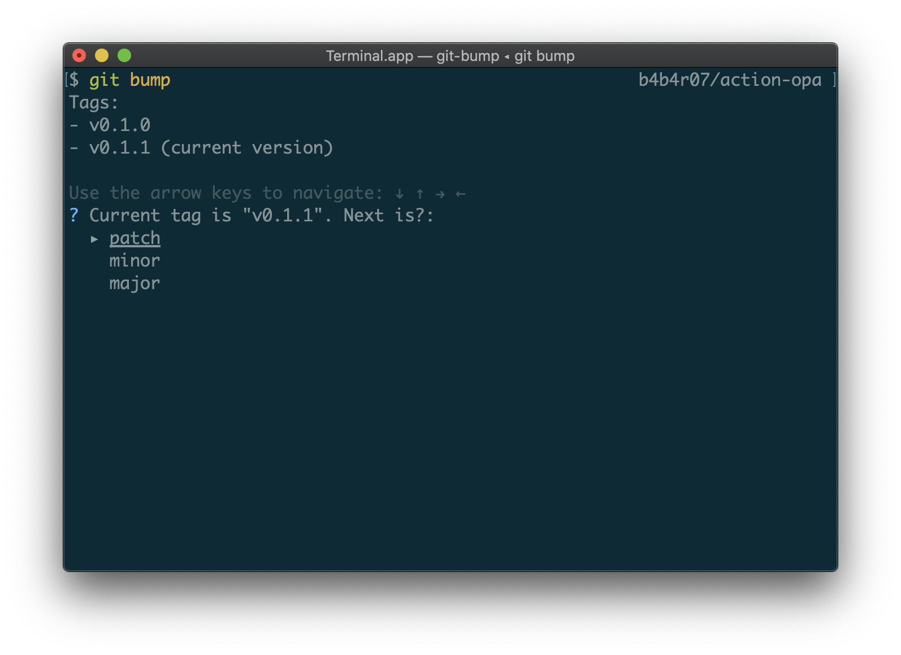

git-bump
========

Bump version (git tag) to next one with [semver](https://semver.org/).



## Usage

```console
$ git bump
Tags:
- v0.1.0
- v0.1.1
- v0.1.2
- v0.2.0
- v0.2.1
- v1.0.0
- v2.0.0
- v2.0.1 (current version)

Use the arrow keys to navigate: ↓ ↑ → ←
? Current tag is "v2.0.1". Next is?:
  ▸ patch
    minor
    major
```

## Installation

Download the binary from [GitHub Releases][release] and drop it in your `$PATH`.

- [Darwin / Mac][release]
- [Linux][release]

## License

[MIT][license]

[release]: https://github.com/b4b4r07/git-bump/releases/latest
[license]: https://b4b4r07.mit-license.org
